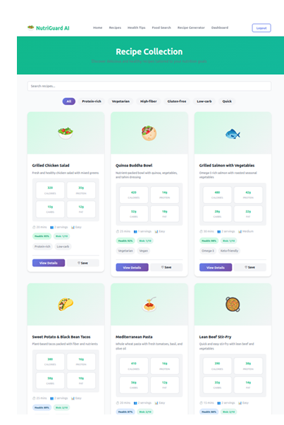
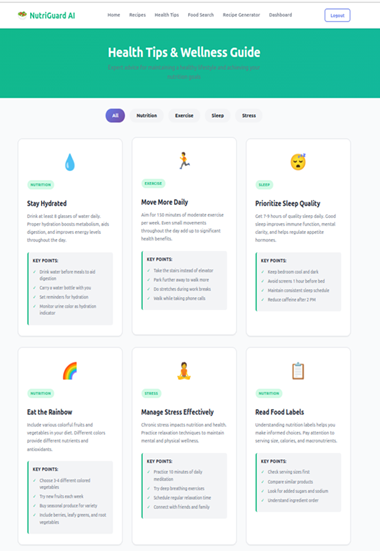
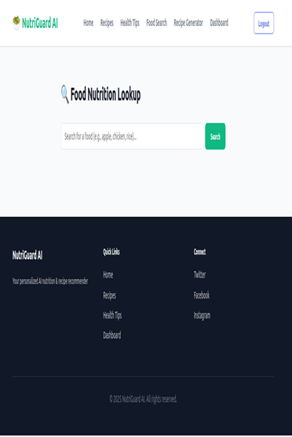
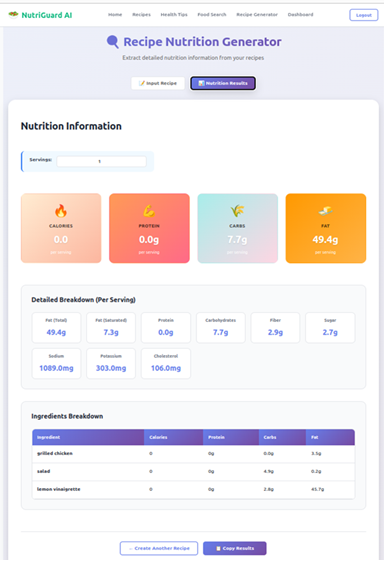
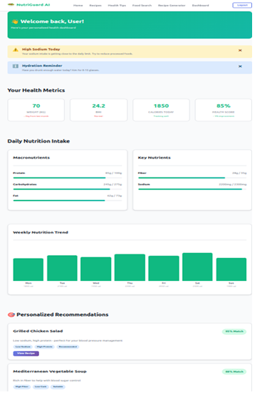

# 🥗 NutriGuard AI – Intelligent Health-Aware Food Recommendation System

## 📌 Project Overview
NutriGuard AI is an AI-driven health-focused food recommendation system designed to promote healthy eating habits through personalized and explainable recommendations. The system analyzes user health conditions, dietary preferences, and nutritional values to suggest safe and suitable recipes.

## ❓ Problem Statement
Unhealthy eating habits are increasing lifestyle diseases such as diabetes, hypertension, and obesity. Existing food recommendation systems provide generic suggestions without considering individual health conditions or nutritional risks. NutriGuard AI addresses this gap by delivering health-aware and personalized recommendations.

## 🧠 Solution
NutriGuard AI uses machine learning techniques to:
- Analyze nutritional values (calories, sugar, sodium, fat)
- Recommend recipes based on health conditions
- Warn users about unsafe food choices
- Provide explainable AI-based insights for each recommendation

## 🏗️ System Architecture
- User health profile input
- Recipe & nutrition database
- ML-based recommendation engine (content-based filtering)
- Nutrition analysis & alert module
- User-friendly interface for results

## ⚙️ ML Approach
- Content-Based Filtering
- Nutritional suitability scoring
- Explainable AI logic for recommendations and alerts

## 🚀 Key Features
- Health-condition–based recipe recommendations
- Real-time nutritional analysis
- Explainable recommendations
- Preventive healthcare support
- Clean and intuitive UI

## 🛠️ Tech Stack
- Python
- Machine Learning
- Nutrition datasets / APIs
- UI Framework (Web-based interface)

## 🎥 Demo
Demo video available here:  
📎 https://drive.google.com/file/d/1fHqzwTXD8zlupUn-N8EzOhlQYPW7F1E4/view?usp=sharing
## 📷 Screenshots

### Home Interface

### Recipe Collection

### Health Tips & Wellness

### Food Nutrition Lookup

### Recipe Nutrition Generator

### User Dashboard

## 📘 Learning Outcomes
- Designing AI-driven recommendation systems
- Applying ML to healthcare use cases
- Building explainable and user-centric AI solutions
- Understanding end-to-end system design

> Note: This project was developed in a college lab environment using AI-assisted development tools. The repository focuses on system design, ML logic, and project outcomes.
